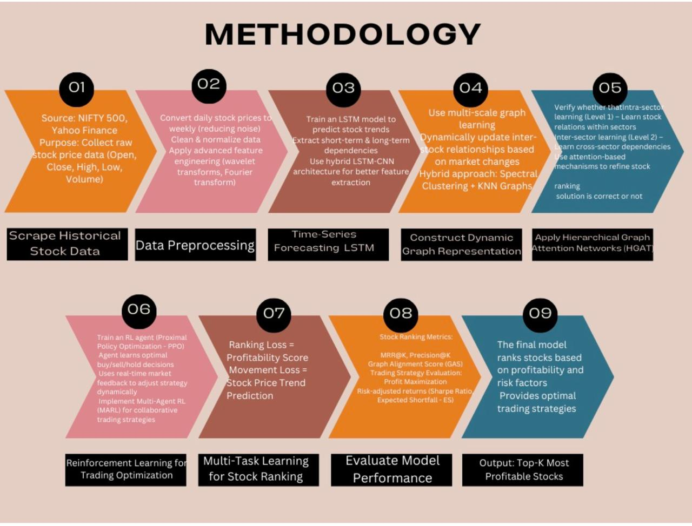
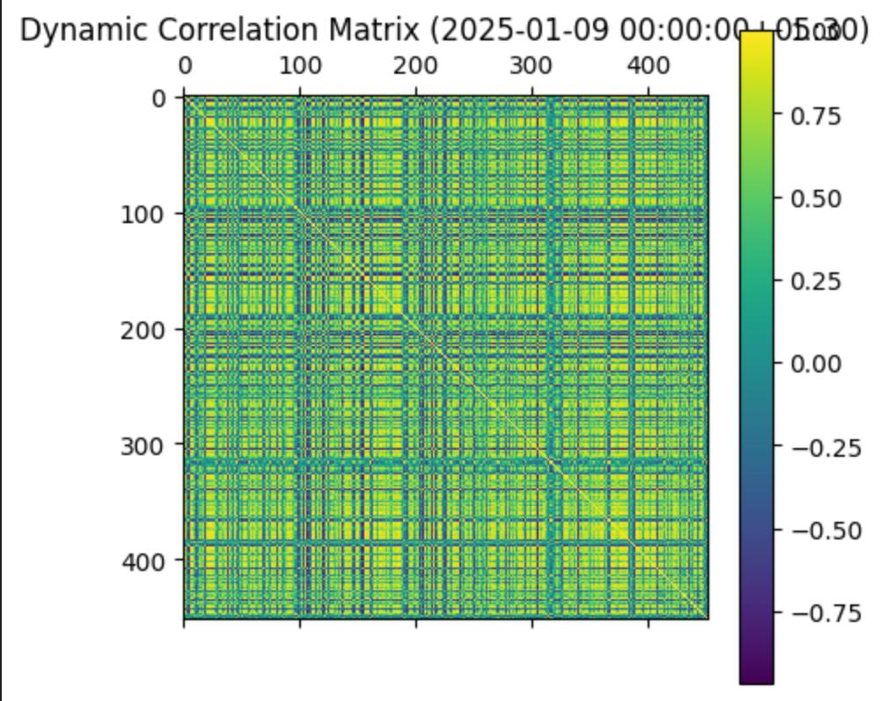
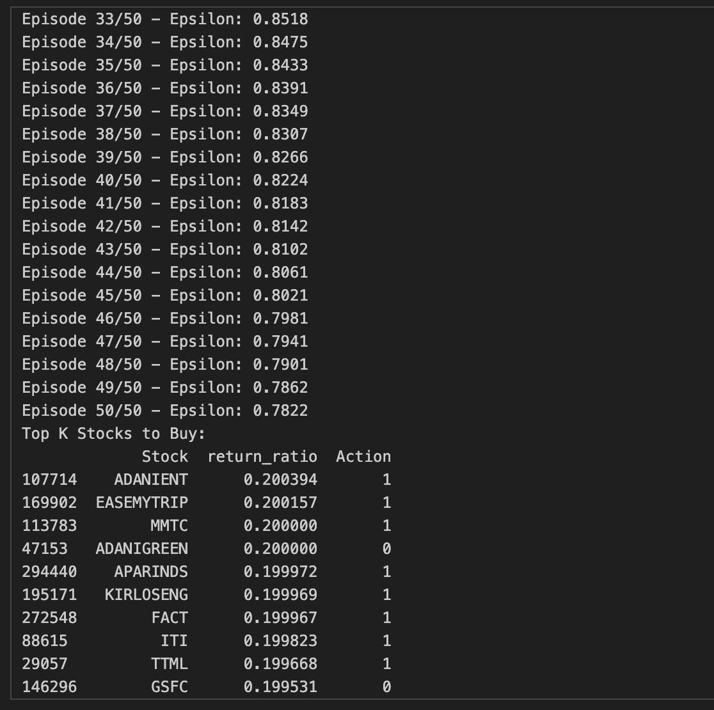
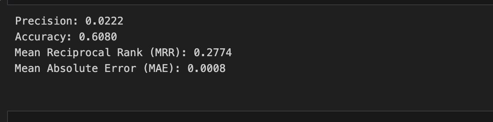
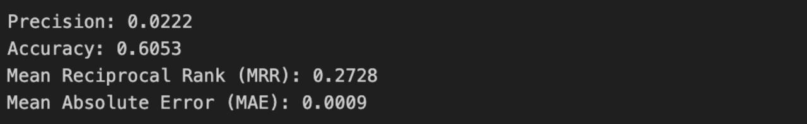

# Top-K Stock Prediction using Dynamic Graphs and Reinforcement Learning



**Full Project Report**: [View the complete technical report online](https://www.overleaf.com/read/tqyczgjmryws#1c0876)

## Table of Contents
1. [Project Overview](#project-overview)
2. [Repository Structure](#repository-structure)
3. [Installation](#installation)
4. [Running the Project](#running-the-project)
5. [Results](#results)
6. [Contributors](#contributors)
7. [License](#license)

## Project Overview
This project predicts top-K profitable stocks using a combination of:
- **Dynamic Correlation Graphs**: Captures temporal inter-stock relationships that evolve over time.
- **LSTM (Long Short-Term Memory)**: Extracts temporal patterns from price histories.
- **Reinforcement Learning (R-Learning)**: Learns an optimal policy for ranking stocks.
- **Multi-Stage Fusion**: Integrates graph-based insights with LSTM features for decision making.

Key Features:
- Avoids static sector-based modeling; uses dynamic graph construction from correlations
- Leverages LSTM to understand stock trends over multiple time windows
- Applies reinforcement learning for adaptive ranking strategy
- Focuses on prediction robustness in volatile market periods

## Repository Structure
stock-prediction-dynamic/
├── notebooks/
│   └── DS_TASK1-2_modified-2.ipynb       # Full pipeline from graph creation to prediction
├── images/
│   ├── pipeline.png                      # Model pipeline and system overview
│   └── results.png                       # Evaluation plots and visual performance
└── models/
    └── saved_rl_models/                 # Directory for saved reinforcement learning agents


## Installation

1. **Create a virtual environment (optional but recommended)**
   ```bash
   python -m venv venv
   source venv/bin/activate  # On Windows: venv\Scripts\activate
2. **Install dependencies**
   ```bash
   pip install pandas numpy matplotlib seaborn scikit-learn torch networkx
   ```
## Data Preparation

1. **Stock Price Data**
   - This project assumes historical stock OHLCV data is already preprocessed or fetched via an external source.
   - Ensure data is in a pandas-readable format (e.g., CSV or DataFrame) containing:
     - `Date`
     - `Open`, `High`, `Low`, `Close`, `Volume`
     - `Stock Symbol` (Ticker)

2. **Dynamic Graph Construction**
   - For each trading day, a correlation matrix is computed across selected stock symbols.
   - A threshold-based method converts the correlation matrix into an adjacency matrix, forming a **daily dynamic graph**.
   - These graphs are used as the environment for the RL agent.

3. **Feature Engineering**
   - LSTM is used to learn historical patterns from stock price sequences.
   - Graph-based features are merged with LSTM outputs for enhanced market representation.

4. **Reward Signal for RL Agent**
   - Reward functions are based on return prediction and selection accuracy.
   - Stocks selected with higher returns receive positive feedback for policy learning.

## Running the Project

1. Open the notebook:

2. Execute all cells in order to:
- Construct daily dynamic graphs
- Train the LSTM model for temporal features
- Train the RL agent using custom Gym environment
- Predict and rank Top-K stocks using learned policy

3. Results including graphs, performance plots, and model predictions are saved or displayed inline.

## Results






- Predicts top-K profitable stocks
- Evaluation metrics:
  - **MRR@K**: Mean Reciprocal Rank at K
  - **Precision@K**: Precision at top-K
- Visual results saved in:
  ```
  images/results.png
  ```

## Contributors

- **Your Name** – Core development, pipeline design, and model integration

## License

This project is licensed under the MIT License.
